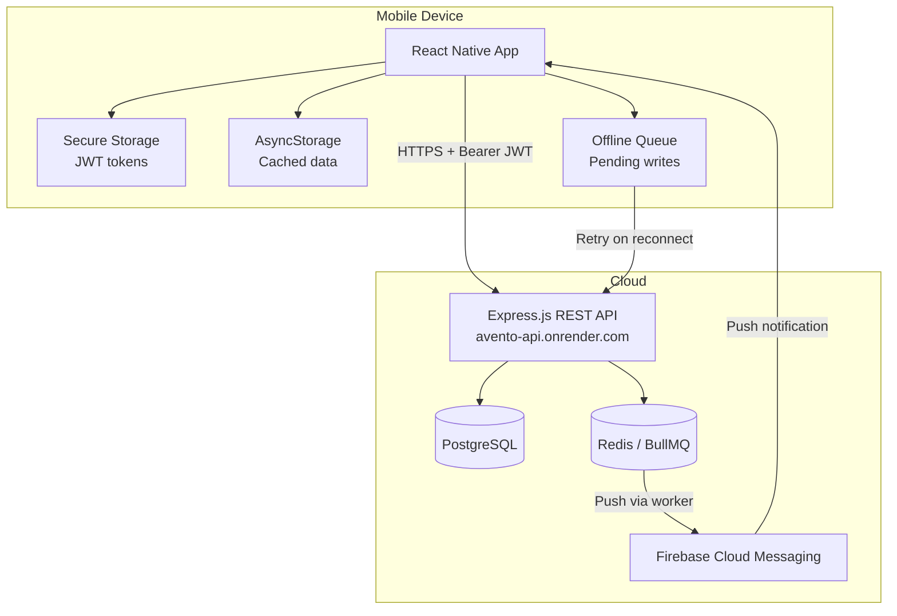
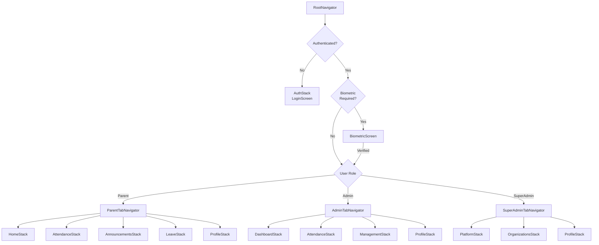

# Design Document: Native Mobile App

## Overview

This document describes the technical design for the Avento Native Mobile App — a React Native (Expo) Android application that provides Parent, Admin, and SuperAdmin users with a native mobile experience for the Avento People Presence Platform.

The app communicates exclusively with the existing Express.js REST API at `https://avento-api.onrender.com`. It reuses the same API contracts already consumed by the `parent-app` PWA and the `frontend` admin dashboard, requiring zero backend changes.

### Design Goals

1. **Fast attendance marking** — The Admin bulk-attendance flow completes in under 3 taps after selecting a group.
2. **Offline resilience** — Read operations show cached data; write operations queue locally and sync when connectivity returns.
3. **Secure multi-tenant isolation** — JWT + Secure Storage + org-scoped API calls ensure data never leaks between tenants.
4. **Native feel** — 60fps transitions, skeleton loaders, pull-to-refresh, and biometric unlock.

### Technology Choices

| Concern | Choice | Rationale |
|---------|--------|-----------|
| Framework | React Native (Expo SDK 51+) | Rapid dev, EAS Build for APK/AAB, rich ecosystem |
| Navigation | React Navigation 6 (bottom-tabs + native-stack) | Industry standard for RN, supports role-based tabs |
| State | Zustand + React Query (TanStack Query) | Zustand for auth/global state; React Query for server cache, background refetch, offline |
| Storage (sensitive) | expo-secure-store | Android Keystore-backed encryption for JWT |
| Storage (cache) | @react-native-async-storage/async-storage | Persistent cache for offline read access |
| HTTP | axios | Consistent with existing parent-app; interceptor pattern reusable |
| Push | expo-notifications + FCM | Free tier sufficient; backend already has web-push worker |
| Biometric | expo-local-authentication | Wraps Android BiometricPrompt |
| Build | EAS Build | Cloud builds for APK (dev) and AAB (Play Store) |

---

## Architecture

### High-Level System Diagram



### Layered Architecture

```
┌────────────────────────────────────────────────────┐
│                   UI Layer                          │
│  Screens / Components / Navigation                 │
├────────────────────────────────────────────────────┤
│                State Layer                          │
│  Zustand (auth, offline queue)                     │
│  React Query (server state, caching)               │
├────────────────────────────────────────────────────┤
│               Service Layer                         │
│  API Client (axios + interceptors)                 │
│  Offline Queue Manager                             │
│  Push Notification Service                         │
│  Biometric Service                                 │
├────────────────────────────────────────────────────┤
│              Platform Layer                          │
│  expo-secure-store  |  AsyncStorage  |  NetInfo    │
│  expo-notifications |  expo-local-authentication   │
└────────────────────────────────────────────────────┘
```

---

## Components and Interfaces

### Navigation Architecture



### Screen Inventory

| Role | Tab | Screens |
|------|-----|---------|
| Parent | Home | ChildrenListScreen |
| Parent | Attendance | AttendanceHistoryScreen, AttendanceCalendarScreen |
| Parent | Announcements | AnnouncementListScreen, AnnouncementDetailScreen |
| Parent | Leave | LeaveListScreen, LeaveFormScreen |
| Parent | Profile | ProfileScreen, ChangePasswordScreen, NotificationsScreen |
| Admin | Dashboard | DashboardScreen |
| Admin | Attendance | GroupListScreen, BulkMarkingScreen |
| Admin | Management | StudentsScreen, StudentFormScreen, GroupsScreen, GroupFormScreen, LeaveManagementScreen, AnnouncementsScreen, AnnouncementFormScreen, ReportsScreen, HolidaysScreen, HolidayFormScreen, AuditLogsScreen |
| Admin | Profile | ProfileScreen, ChangePasswordScreen |
| SuperAdmin | Platform | PlatformDashboardScreen |
| SuperAdmin | Organizations | OrgListScreen, OrgFormScreen, OrgDetailScreen |
| SuperAdmin | Profile | ProfileScreen, ChangePasswordScreen |

### API Client Interface

```typescript
// src/api/client.ts
interface ApiClientConfig {
  baseURL: string;        // https://avento-api.onrender.com
  timeout: number;        // default 30_000ms
  getToken: () => Promise<string | null>;
  onUnauthorized: () => void;
}

// Interceptors:
// 1. Request: attach Bearer token from SecureStore
// 2. Request: attach organization_id header if present in session
// 3. Response 401: trigger onUnauthorized → logout flow
// 4. Response timeout/network error: reject with typed OfflineError
```

### Auth Store Interface (Zustand)

```typescript
interface AuthState {
  token: string | null;
  user: AppUser | null;
  isAuthenticated: boolean;
  isLoading: boolean;
  biometricEnabled: boolean;

  login: (email: string, password: string, orgName: string, orgId?: string) => Promise<void>;
  logout: () => Promise<void>;
  refreshToken: () => Promise<void>;
  enableBiometric: () => Promise<void>;
  disableBiometric: () => void;
  restoreSession: () => Promise<void>;
}
```

### Offline Queue Interface

```typescript
interface QueuedOperation {
  id: string;           // UUID
  timestamp: number;    // Date.now() when queued
  method: 'POST' | 'PUT' | 'PATCH' | 'DELETE';
  url: string;
  body: unknown;
  retries: number;
  maxRetries: number;
  status: 'pending' | 'processing' | 'failed';
}

interface OfflineQueueStore {
  queue: QueuedOperation[];
  isProcessing: boolean;

  enqueue: (op: Omit<QueuedOperation, 'id' | 'timestamp' | 'retries' | 'status'>) => void;
  processQueue: () => Promise<void>;
  retryItem: (id: string) => Promise<void>;
  discardItem: (id: string) => void;
  getQueueLength: () => number;
}
```

### Push Notification Service Interface

```typescript
interface PushService {
  requestPermissions: () => Promise<boolean>;
  registerToken: (authToken: string) => Promise<void>;
  handleNotificationReceived: (notification: Notification) => void;
  handleNotificationTapped: (response: NotificationResponse) => void;
  unregister: () => Promise<void>;
}
```

---

## Data Models

### Core Types (reused from existing parent-app types)

```typescript
// Presence status enum
type PresenceStatus = 'Present' | 'Absent' | 'Late' | 'On_Leave';
type DisplayPresenceStatus = PresenceStatus | 'Not yet marked';

// User roles
type AppRole = 'Admin' | 'SuperAdmin' | 'Stakeholder';

// User object returned by login
interface AppUser {
  id: string;
  email: string;
  role: AppRole;
  organization_id: string;
}

// Organization
interface Organization {
  id: string;
  name: string;
}
```

### Parent Domain Models

```typescript
interface PersonWithStatus {
  id: string;
  name: string;
  current_status: { presence_status: PresenceStatus; time: string } | null;
}

interface AttendanceRecord {
  id: string;
  date: string;           // YYYY-MM-DD
  time: string | null;
  presence_status: PresenceStatus;
}

interface Announcement {
  id: string;
  title: string;
  body: string;
  published_at: string;   // ISO timestamp
}

interface Notification {
  id: string;
  title: string;
  body: string;
  sent_at: string | null;
  created_at: string;     // ISO timestamp
}

interface LeaveRequest {
  id: string;
  person_id: string;
  person_name?: string;
  start_date: string;     // YYYY-MM-DD
  end_date: string;       // YYYY-MM-DD
  reason: string;
  leave_type?: string;
  status: 'Pending' | 'Approved' | 'Rejected';
  remarks?: string;
}
```

### Admin Domain Models

```typescript
interface Group {
  id: string;
  name: string;
  description?: string;
  member_count: number;
  attendance_marked_today: boolean;
}

interface Person {
  id: string;
  name: string;
  roll_number?: string;
  admission_number?: string;
  parent_mobile?: string;
  parent_email?: string;
  gender?: string;
  date_of_birth?: string;
  guardian_name?: string;
  group_id?: string;
  group_name?: string;
  is_active: boolean;
}

interface BulkAttendancePayload {
  group_id: string;
  date: string;           // YYYY-MM-DD
  records: Array<{
    person_id: string;
    presence_status: PresenceStatus;
  }>;
}

interface Holiday {
  id: string;
  date: string;           // YYYY-MM-DD
  name: string;
  description?: string;
}

interface AuditLogEntry {
  id: string;
  action: string;
  entity_type: string;
  entity_id: string;
  user_id: string;
  user_email: string;
  timestamp: string;      // ISO timestamp
}

interface AttendanceReport {
  person_id: string;
  person_name: string;
  present_count: number;
  absent_count: number;
  late_count: number;
  on_leave_count: number;
  total_days: number;
  attendance_percentage: number;
}
```

### SuperAdmin Domain Models

```typescript
interface PlatformStats {
  total_organizations: number;
  total_users: number;
  total_persons: number;
  today_present: number;
  today_absent: number;
  today_late: number;
}

interface OrganizationDetail {
  id: string;
  name: string;
  plan_type: string;
  user_count: number;
  person_count: number;
  created_at: string;
}
```

### Local Storage Models

```typescript
// Stored in AsyncStorage for offline cache
interface CacheEntry<T> {
  data: T;
  fetchedAt: number;      // Date.now() timestamp
  key: string;            // cache key (e.g., 'children_list', 'attendance_2024-01-15')
}

// Stored in SecureStore
interface SecureSession {
  token: string;
  user: string;           // JSON-serialized AppUser
  biometricEnabled: boolean;
}
```

---

## Correctness Properties

*A property is a characteristic or behavior that should hold true across all valid executions of a system — essentially, a formal statement about what the system should do. Properties serve as the bridge between human-readable specifications and machine-verifiable correctness guarantees.*

### Property 1: Token storage round-trip

*For any* valid JWT token string, storing it in Secure Storage and then retrieving it SHALL produce the identical token string.

**Validates: Requirements 1.2, 20.1**

### Property 2: Offline queue ordering preservation

*For any* sequence of operations enqueued while offline, processing the queue after connectivity is restored SHALL execute them in the same chronological order they were enqueued.

**Validates: Requirements 21.2, 21.3**

### Property 3: Offline queue idempotent processing

*For any* queued operation that has already been successfully processed, re-processing the queue SHALL NOT submit the same operation twice (processing is idempotent).

**Validates: Requirements 21.3, 21.4**

### Property 4: Role-based navigation isolation

*For any* authenticated user with role R (Parent, Admin, or SuperAdmin), the set of accessible tab screens SHALL be exactly the set defined for role R, and attempting to navigate to a screen belonging to a different role SHALL redirect to R's dashboard.

**Validates: Requirements 2.1, 2.2, 2.3, 2.5**

### Property 5: Bulk attendance payload completeness

*For any* group of N active students where the Admin submits attendance, the resulting API payload SHALL contain exactly N attendance records, one per student, each with a valid PresenceStatus value and the correct group_id and date.

**Validates: Requirements 10.4, 10.5**

### Property 6: Attendance default-to-Present invariant

*For any* group of N persons loaded for attendance marking, all N students SHALL initially have status "Present" before any user interaction modifies them.

**Validates: Requirements 10.3**

### Property 7: Logout clears all sensitive data

*For any* authenticated session (regardless of role, cached data volume, or session duration), invoking logout SHALL result in Secure Storage containing no JWT tokens and AsyncStorage containing no cached data.

**Validates: Requirements 1.7, 20.3**

### Property 8: Token refresh timing

*For any* JWT with an expiration timestamp, the app SHALL trigger a silent refresh if and only if the remaining time-to-expiry is less than or equal to 5 minutes.

**Validates: Requirements 1.5**

### Property 9: Leave request form validation

*For any* leave request form input, if start_date > end_date OR any required field (person_id, start_date, end_date, reason) is empty, the submission SHALL be rejected locally with appropriate field-level errors and no API call SHALL be made.

**Validates: Requirements 6.2, 6.4**

### Property 10: Cache staleness indicator presence

*For any* screen displaying cached data when the device is offline, a visual offline-status indicator SHALL be rendered alongside the cached content.

**Validates: Requirements 3.5, 21.1**

### Property 11: Organization search filtering

*For any* search string S and list of organizations, the filtered result SHALL contain exactly the organizations whose name includes S as a case-insensitive substring.

**Validates: Requirements 24.1, 24.2**

### Property 12: Attendance summary computation

*For any* list of AttendanceRecords, the computed summary counts (present_count, absent_count, late_count, on_leave_count) SHALL equal the actual count of each respective PresenceStatus in the input list.

**Validates: Requirements 4.4**

### Property 13: Chronological list ordering

*For any* list of time-stamped items (Announcements by published_at, Notifications by created_at), the displayed order SHALL be reverse chronological (most recent first).

**Validates: Requirements 5.2, 7.2**

### Property 14: Password change validation

*For any* password change form input, the form SHALL be submittable if and only if the new password is at least 6 characters long AND the new password field equals the confirm password field.

**Validates: Requirements 8.2**

---

## Error Handling

### Error Categories and Strategies

| Error Type | Detection | User Feedback | Recovery |
|------------|-----------|---------------|----------|
| Network timeout | axios timeout / NetInfo offline | Banner: "No connection" + cached data | Auto-retry on reconnect |
| 401 Unauthorized | Response interceptor | Redirect to login screen | Clear session, re-auth |
| 403 Forbidden | Response status | Toast: "You don't have permission" | Navigate to own dashboard |
| 422 Validation | Response body with field errors | Inline field-level errors | User corrects and resubmits |
| 500 Server Error | Response status >= 500 | Toast: "Something went wrong, try again" | Retry button |
| Biometric failure | expo-local-authentication error | Prompt: "Try again" + fallback to PIN/password | Allow retry or credential login |
| Secure Storage failure | expo-secure-store error | Force logout with explanation | Re-authenticate |
| Offline write | NetInfo offline during POST/PUT | Enqueue to offline queue + pending indicator | Auto-process on reconnect |

### Retry Strategy

- **Exponential backoff**: 1s → 2s → 4s → 8s → 16s (max 5 retries)
- **Idempotency**: POST operations include a client-generated idempotency key in headers
- **Queue items**: Max 3 automatic retries, then notify user for manual action

### Global Error Boundary

A top-level React error boundary catches unhandled exceptions and displays a recovery screen with:
- Error summary (user-friendly)
- "Restart App" button (resets navigation state)
- "Report Issue" link (opens email with diagnostics)

---

## Testing Strategy

### Unit Tests (Jest + React Native Testing Library)

- **Auth logic**: login flow, token refresh timing, logout cleanup
- **Form validation**: leave request validation, student form validation, password rules
- **Offline queue**: enqueue/dequeue operations, ordering, deduplication
- **Navigation guards**: role-to-tab mapping, unauthorized redirect
- **Data formatting**: date formatting, presence status display, attendance summary calculation

### Property-Based Tests (fast-check)

Property-based testing is appropriate for this feature because the app contains:
- Pure functions for data transformation (attendance calculations, status mapping, sorting)
- Serialization round-trips (secure storage read/write)
- Queue ordering invariants
- Input validation logic with large input spaces (form validation, search filtering)

**Configuration**: Minimum 100 iterations per property test.

**Tag format**: `Feature: native-mobile-app, Property {N}: {description}`

Tests to implement:
- Token storage round-trip (Property 1)
- Offline queue ordering (Property 2)
- Offline queue idempotent processing (Property 3)
- Role navigation isolation (Property 4)
- Bulk attendance payload completeness (Property 5)
- Attendance default-to-Present invariant (Property 6)
- Logout data clearing (Property 7)
- Token refresh timing (Property 8)
- Leave request form validation (Property 9)
- Cache staleness indicator presence (Property 10)
- Organization search filtering (Property 11)
- Attendance summary computation (Property 12)
- Chronological list ordering (Property 13)
- Password change validation (Property 14)

### Integration Tests

- **API client**: Verify interceptor behavior with mocked axios (token attachment, 401 handling)
- **Push notifications**: Verify token registration and deep-link routing
- **Offline queue processing**: End-to-end queue → API with mock server

### E2E Tests (Detox)

- Login flow (credentials + biometric)
- Admin bulk attendance marking
- Parent view children status
- Offline → online sync flow
- Push notification tap → correct screen

### Test Infrastructure

| Tool | Purpose |
|------|---------|
| Jest | Unit + property test runner |
| fast-check | Property-based testing library |
| React Native Testing Library | Component rendering tests |
| MSW (Mock Service Worker) | API mocking for integration tests |
| Detox | E2E tests on Android emulator |
