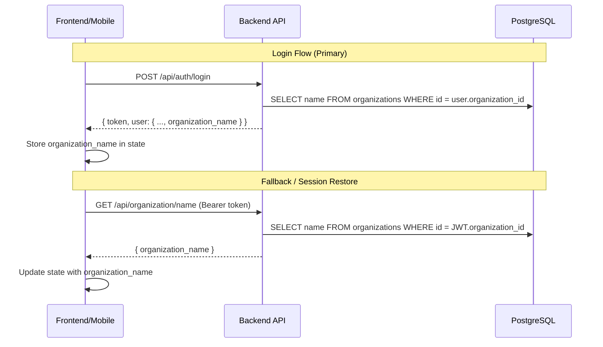
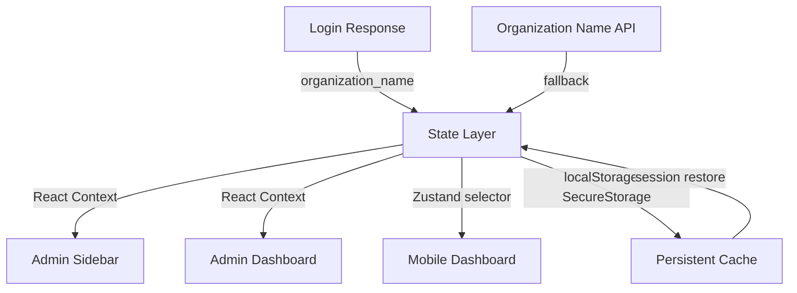

# Design Document: School Branding Personalization

## Overview

This feature adds organization/school branding to the user experience across both the Admin Panel (React/Vite) and the Mobile App (React Native/Expo). The organization name is resolved from the backend and displayed prominently in the sidebar, dashboard headings, and mobile dashboard screens.

The design leverages the existing `organizations` table in PostgreSQL (via Knex), the JWT-based authentication flow, and the established state management patterns (React Context in the Admin Panel, Zustand store in the Mobile App).

### Key Design Decisions

1. **Include `organization_name` in login response** — Eliminates a separate API call on initial login, providing instant branding without a loading flash.
2. **Dedicated Organization Name API endpoint** — Provides a fallback mechanism for session restore and token refresh scenarios where the login response isn't available.
3. **State-level caching** — The organization name is stored in AuthContext (Admin Panel) and Zustand store (Mobile App) to avoid redundant API calls across page navigations.
4. **Graceful degradation** — "My School" fallback text ensures the UI never shows an empty or broken state.

## Architecture



### Data Flow



## Components and Interfaces

### Backend Components

#### 1. Organization Name API Endpoint

**Route:** `GET /api/organization/name`  
**Middleware:** `authenticate`, `tenantIsolation`  
**File:** `src/routes/organization.ts` (add new route)

```typescript
// Response shape
interface OrganizationNameResponse {
  organization_name: string;
}

// Error response (404)
interface OrganizationNotFoundError {
  error: string; // "Organization not found"
}
```

#### 2. Login Response Enhancement

**Route:** `POST /api/auth/login` (existing, modified)  
**File:** `src/routes/auth.ts`

Enhanced user object in login response:
```typescript
interface LoginResponseUser {
  id: string;
  email: string;
  role: string;
  organization_id: string;
  organization_name?: string; // NEW — omitted if org not found
}
```

### Admin Panel Components

#### 3. AuthContext Enhancement

**File:** `frontend/src/context/AuthContext.tsx`

Extended state shape:
```typescript
interface AuthState {
  token: string | null;
  user: User | null;
  isAuthenticated: boolean;
  isLoading: boolean;
  teacherContext: TeacherContext | null;
  organizationName: string | null; // NEW
}
```

The context will:
- Extract `organization_name` from the login response and store it
- Persist it to `localStorage` under key `organizationName`
- Clear it on logout
- Retain it across token refreshes (no re-fetch needed)
- Expose it via `useAuth().organizationName`

#### 4. Sidebar Branding Component

**File:** `frontend/src/layouts/AdminLayout.tsx` (modified)

Renders the organization name below the "Avento" title in the sidebar header. Uses a skeleton/placeholder while loading, and "My School" as fallback.

#### 5. Dashboard Heading Enhancement

**File:** `frontend/src/pages/admin/DashboardPage.tsx` (modified)

Replaces the static "Admin Dashboard" heading with `"{organizationName} Dashboard"`. Shows a skeleton placeholder while loading.

### Mobile App Components

#### 6. Auth Store Enhancement

**File:** `avento-mobile/src/stores/auth.ts`

Extended state:
```typescript
interface AuthState {
  // ... existing fields
  organizationName: string | null; // NEW
}
```

The store will:
- Extract `organization_name` from login response
- Persist it in SecureStorage alongside the session
- Restore it on session restore from SecureStorage
- Fetch from Organization Name API if cached value is missing during restore
- Clear it on logout

#### 7. Mobile Dashboard Branding

**File:** `avento-mobile/src/screens/admin/DashboardScreen.tsx` (modified)  
Also applies to Teacher and Parent/Stakeholder dashboard screens.

Displays the organization name prominently above or alongside the date heading. Uses SkeletonLoader while loading, "My School" as fallback.

## Data Models

### Existing Table: `organizations`

| Column | Type | Description |
|--------|------|-------------|
| id | UUID (PK) | Organization identifier |
| name | VARCHAR | Organization/school name |
| industry_module | VARCHAR | Module type |
| metadata | JSONB | Additional settings |
| created_at | TIMESTAMP | Creation timestamp |
| updated_at | TIMESTAMP | Last update timestamp |

No schema changes are required. The feature reads the existing `name` column.

### State Shape Changes

**Admin Panel localStorage:**
```
organizationName: string | null  (new key)
```

**Mobile App SecureStorage:**
The existing session object (`{ token, user, biometricEnabled }`) is extended:
```typescript
interface PersistedSession {
  token: string;
  user: AppUser;
  biometricEnabled: boolean;
  organizationName?: string; // NEW
}
```

### Mobile App Type Extension

```typescript
// avento-mobile/src/types/auth.ts
interface AppUser {
  id: string;
  email: string;
  role: AppRole;
  organization_id: string;
  permissions?: TeacherPermission[];
  organization_name?: string; // NEW — from login response
}
```

## Correctness Properties

*A property is a characteristic or behavior that should hold true across all valid executions of a system — essentially, a formal statement about what the system should do. Properties serve as the bridge between human-readable specifications and machine-verifiable correctness guarantees.*

### Property 1: Organization Name API returns correct name

*For any* authenticated request where the JWT's `organization_id` corresponds to an existing record in the organizations table, the Organization Name API SHALL return the exact `name` value from that record.

**Validates: Requirements 1.1**

### Property 2: Login response includes correct organization name

*For any* successful login where the user's `organization_id` maps to an existing organization record, the `organization_name` field in the login response SHALL equal the `name` column from the organizations table for that organization ID.

**Validates: Requirements 7.1, 7.2**

### Property 3: Admin Panel state cleared on logout

*For any* authenticated session in the Admin Panel where an organization name is stored, after logout completes, the organization name SHALL be null in both the AuthContext state and localStorage.

**Validates: Requirements 5.3**

### Property 4: Mobile App state cleared on logout

*For any* authenticated session in the Mobile App where an organization name is stored, after logout completes, the organization name SHALL be null in both the Zustand store state and SecureStorage.

**Validates: Requirements 6.3**

### Property 5: Token refresh preserves organization name

*For any* stored organization name in the Admin Panel AuthContext, a token refresh event SHALL leave the organization name unchanged in state.

**Validates: Requirements 5.4**

### Property 6: Session restore recovers cached organization name

*For any* persisted session in the Mobile App SecureStorage that includes a non-null organization name, calling restoreSession SHALL make that same organization name available in the Zustand store without triggering an API call.

**Validates: Requirements 6.4**

### Property 7: Fallback display returns "My School" for invalid names

*For any* organization name value that is null, undefined, empty string, or composed entirely of whitespace, the display helper function SHALL return the string "My School".

**Validates: Requirements 2.4, 4.4**

## Error Handling

| Scenario | Backend Behavior | Frontend/Mobile Behavior |
|----------|-----------------|--------------------------|
| Organization not found (API) | Return 404 `{ error: "Organization not found" }` | Display "My School" fallback |
| Organization not found (login) | Complete login, omit `organization_name` from response | Display "My School" fallback |
| Network failure on org name fetch | N/A | Display "My School" fallback |
| Unauthenticated request to API | Return 401 `{ error: "Authentication required" }` | Redirect to login (existing 401 handler) |
| Organization name is empty string in DB | Return empty string | Display "My School" fallback (treat empty as missing) |

### Fallback Logic (shared)

```typescript
function getDisplayName(organizationName: string | null | undefined): string {
  return organizationName?.trim() || 'My School';
}
```

## Testing Strategy

### Unit Tests (Example-based)

- **Backend:** Test the new `/api/organization/name` endpoint with valid auth, missing org, no auth
- **Backend:** Test login response includes `organization_name` for valid org, omits for missing org
- **Admin Panel:** Test AuthContext stores/clears org name on login/logout
- **Admin Panel:** Test sidebar displays org name, shows skeleton while loading, shows fallback on error
- **Admin Panel:** Test dashboard heading includes org name
- **Mobile App:** Test Zustand store stores/clears org name on login/logout
- **Mobile App:** Test session restore reads org name from SecureStorage
- **Mobile App:** Test dashboard displays org name with correct styling
- **Mobile App:** Test fallback to "My School" when name unavailable

### Property-Based Tests

Property-based testing is appropriate for this feature because:
- The organization name resolution is a pure function of database state (input varies by organization records)
- The state management logic (store/clear/restore) follows universal invariants
- The fallback logic must handle any possible string input

**Library:** [fast-check](https://github.com/dubzzz/fast-check) (already available in the ecosystem for TypeScript/JavaScript projects)

**Configuration:** Minimum 100 iterations per property test.

Each property test MUST be tagged with:
```
// Feature: school-branding-personalization, Property N: <property text>
```

### Integration Tests

- End-to-end login flow verifies `organization_name` appears in sidebar and dashboard
- Session restore on mobile app launch correctly displays cached org name
- Network failure gracefully falls back to "My School"
