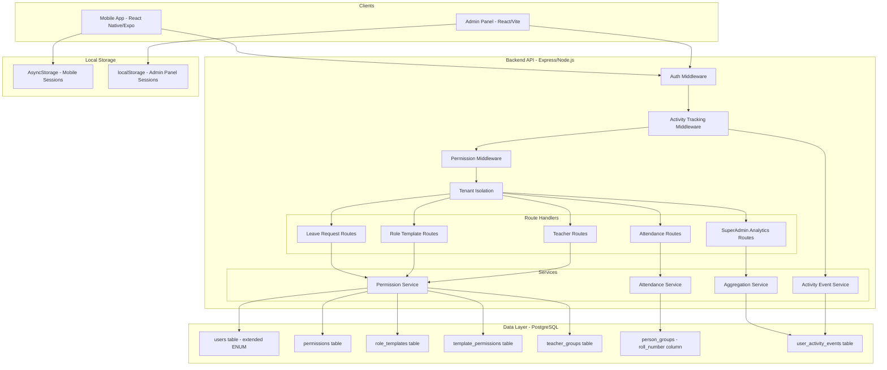

# Design Document: Teacher Roles and Attendance Flow

## Overview

This design extends the Avento People Presence Platform with three major feature areas:

1. **Teacher Roles & Permissions** — A granular permission system allowing Admins to create Teacher users with configurable access levels, group them using Role Templates, and scope their data access to assigned Groups.

2. **Sequential Attendance Marking** — A new attendance flow where students appear one-by-one in roll number order, with local session persistence for interruption recovery, complementing the existing bulk marking mode.

3. **Super Admin Activity Analytics** — Platform-wide DAU/WAU/MAU/YAU tracking via asynchronous activity event recording, with aggregation queries and a dashboard for the Super Admin.

The design builds on the existing Express/Knex/PostgreSQL backend, React/Vite admin panel, and React Native/Expo mobile app, extending them with minimal breaking changes to the current API surface.

## Architecture



### Key Architectural Decisions

1. **Permission check at middleware level**: The existing `authorize` middleware (role-based) will be extended with a new `requirePermission` middleware that checks granular permissions for Teacher users. Admin and SuperAdmin bypass permission checks.

2. **Effective permissions computed at query time**: Rather than caching denormalized permissions, the system computes effective permissions (union of template + direct permissions) on each request. This ensures instant propagation when templates change (Requirement 2.4) without cache invalidation complexity. For this scale (< 100 permissions per user), the query overhead is negligible.

3. **Sequential attendance as client-side state machine**: The sequential flow is managed entirely client-side (Mobile App and Admin Panel), with only the final bulk submission hitting the backend. The backend already has a `POST /attendance/bulk` endpoint that accepts per-student records — no new backend endpoint is needed for submission.

4. **Activity tracking as non-blocking middleware**: An Express middleware records events asynchronously (fire-and-forget), ensuring recording failures never block or fail the original API response.

5. **Roll number on the join table**: `roll_number` is added to `person_groups` rather than `persons`, because a student can have different roll numbers in different groups/sections.

## Components and Interfaces

### Backend API — New & Modified Components

#### 1. Permission Service (`src/services/permissionService.ts`)

```typescript
interface PermissionService {
  // Computes effective permissions for a user (union of template + direct)
  getEffectivePermissions(userId: string, organizationId: string): Promise<string[]>;
  
  // Checks if a user has a specific permission
  hasPermission(userId: string, organizationId: string, permission: string): Promise<boolean>;
  
  // Assigns direct permission(s) to a user
  assignDirectPermissions(userId: string, organizationId: string, permissions: string[]): Promise<void>;
  
  // Removes direct permission(s) from a user
  removeDirectPermissions(userId: string, organizationId: string, permissions: string[]): Promise<void>;
  
  // Assigns a role template to a user
  assignRoleTemplate(userId: string, templateId: string): Promise<void>;
  
  // Removes a role template assignment from a user
  removeRoleTemplate(userId: string, templateId: string): Promise<void>;
}
```

#### 2. Permission Middleware (`src/middleware/requirePermission.ts`)

```typescript
/**
 * Granular permission middleware factory.
 * For Admin/SuperAdmin: always passes (full access).
 * For Teacher: checks if the user has the required permission.
 * Returns 403 with the specific missing permission name if denied.
 */
function requirePermission(permission: string): RequestHandler;
```

#### 3. Teacher Group Service (`src/services/teacherGroupService.ts`)

```typescript
interface TeacherGroupService {
  // Assigns a teacher to one or more groups
  assignGroups(teacherId: string, groupIds: string[], organizationId: string): Promise<void>;
  
  // Removes teacher from a group
  removeGroup(teacherId: string, groupId: string): Promise<void>;
  
  // Gets all groups assigned to a teacher
  getAssignedGroups(teacherId: string, organizationId: string): Promise<Group[]>;
  
  // Checks if a teacher is assigned to a specific group
  isAssignedToGroup(teacherId: string, groupId: string): Promise<boolean>;
}
```

#### 4. Role Template Routes (`src/routes/roleTemplates.ts`)

| Method | Path | Description | Auth |
|--------|------|-------------|------|
| GET | `/role-templates` | List all templates for org | Admin |
| POST | `/role-templates` | Create a new template | Admin |
| PUT | `/role-templates/:id` | Update template name/permissions | Admin |
| DELETE | `/role-templates/:id` | Delete template (if unassigned) | Admin |

#### 5. Teacher Management Routes (`src/routes/teachers.ts`)

| Method | Path | Description | Auth |
|--------|------|-------------|------|
| GET | `/teachers` | List all teachers in org | Admin |
| POST | `/teachers` | Create a teacher account | Admin |
| PUT | `/teachers/:id` | Update teacher details | Admin |
| DELETE | `/teachers/:id` | Deactivate a teacher | Admin |
| PUT | `/teachers/:id/permissions` | Assign direct permissions | Admin |
| PUT | `/teachers/:id/role-template` | Assign role template | Admin |
| PUT | `/teachers/:id/groups` | Assign groups | Admin |
| GET | `/teachers/:id/groups` | Get assigned groups | Admin |

#### 6. Sequential Attendance Endpoint (`src/routes/attendance.ts` — modified)

| Method | Path | Description | Auth |
|--------|------|-------------|------|
| GET | `/attendance/group/:groupId/members` | Get members sorted by roll_number | Admin, Teacher (mark_attendance) |

This endpoint returns group members in roll-number order for the sequential flow. The existing `POST /attendance/bulk` endpoint is reused for submission (its authorization will be extended to accept Teacher with `mark_attendance` permission).

#### 7. Activity Event Middleware (`src/middleware/activityTracker.ts`)

```typescript
/**
 * Express middleware that asynchronously records an Activity_Event
 * for each authenticated request, excluding health-check and static routes.
 * Recording failures are caught silently and do not affect the response.
 */
function activityTracker(req: Request, res: Response, next: NextFunction): void;
```

#### 8. Analytics Routes (`src/routes/superAdmin.ts` — extended)

| Method | Path | Description | Auth |
|--------|------|-------------|------|
| GET | `/super-admin/analytics` | Get DAU/WAU/MAU/YAU metrics | SuperAdmin |
| GET | `/super-admin/analytics/trend` | Get 30-day DAU trend | SuperAdmin |

### Admin Panel — New Components

#### 1. Teacher Management Pages

- `TeacherListPage` — List of teachers with search/filter
- `TeacherFormPage` — Create/edit teacher account
- `TeacherPermissionsPage` — Assign permissions and role templates
- `TeacherGroupsPage` — Assign groups to teacher

#### 2. Role Template Management Pages

- `RoleTemplateListPage` — List of role templates
- `RoleTemplateFormPage` — Create/edit role template with permission checkboxes

#### 3. Sequential Attendance Components

- `AttendanceModeSelector` — Modal choosing Sequential vs Bulk
- `SequentialAttendanceScreen` — Single-student card with navigation and status buttons
- `AttendanceSummaryScreen` — Summary with counts and confirm button
- `RollNumberEditor` — Admin UI for assigning roll numbers per group

#### 4. Analytics Dashboard Widget (SuperAdmin)

- `AnalyticsDashboardWidget` — DAU/WAU/MAU/YAU cards with 30-day trend chart

### Mobile App — New Components

#### 1. Teacher Navigation Flow

- `TeacherTabNavigator` — Tab navigator showing only permitted screens
- Permission-gated screen visibility using `roleGuard` (existing pattern extended)

#### 2. Sequential Attendance Screens

- `AttendanceModeScreen` — Choose Sequential vs Bulk
- `SequentialAttendanceScreen` — Single-student card with swipe/button navigation
- `AttendanceSummaryScreen` — Summary view with submit

#### 3. Session Persistence Hook

- `useAttendanceSession` — Custom hook managing local session state via AsyncStorage, with auto-save on each mark and 24h expiration logic

#### 4. SuperAdmin Analytics Screen

- `AnalyticsScreen` — DAU/WAU/MAU/YAU display (part of SuperAdminTabNavigator)

## Data Models

### New Tables

#### `permissions` table

| Column | Type | Constraints |
|--------|------|-------------|
| id | UUID | PK, default uuid_generate_v4() |
| user_id | UUID | FK → users.id, NOT NULL |
| permission_name | VARCHAR(50) | NOT NULL |
| organization_id | UUID | FK → organizations.id, NOT NULL |
| granted_at | TIMESTAMPTZ | DEFAULT now() |

**Indexes**: UNIQUE(user_id, permission_name), INDEX(organization_id)

#### `role_templates` table

| Column | Type | Constraints |
|--------|------|-------------|
| id | UUID | PK, default uuid_generate_v4() |
| name | VARCHAR(100) | NOT NULL |
| organization_id | UUID | FK → organizations.id, NOT NULL |
| created_at | TIMESTAMPTZ | DEFAULT now() |
| updated_at | TIMESTAMPTZ | DEFAULT now() |

**Indexes**: UNIQUE(name, organization_id)

#### `template_permissions` table

| Column | Type | Constraints |
|--------|------|-------------|
| template_id | UUID | FK → role_templates.id, ON DELETE CASCADE |
| permission_name | VARCHAR(50) | NOT NULL |

**Indexes**: PK(template_id, permission_name)

#### `user_role_templates` table

| Column | Type | Constraints |
|--------|------|-------------|
| user_id | UUID | FK → users.id, ON DELETE CASCADE |
| template_id | UUID | FK → role_templates.id, ON DELETE RESTRICT |
| assigned_at | TIMESTAMPTZ | DEFAULT now() |

**Indexes**: PK(user_id, template_id)

#### `teacher_groups` table

| Column | Type | Constraints |
|--------|------|-------------|
| teacher_id | UUID | FK → users.id, ON DELETE CASCADE |
| group_id | UUID | FK → groups.id, ON DELETE CASCADE |
| assigned_at | TIMESTAMPTZ | DEFAULT now() |

**Indexes**: PK(teacher_id, group_id), INDEX(group_id)

#### `user_activity_events` table

| Column | Type | Constraints |
|--------|------|-------------|
| id | UUID | PK, default uuid_generate_v4() |
| user_id | UUID | FK → users.id, NOT NULL |
| organization_id | UUID | FK → organizations.id, NOT NULL |
| action_type | VARCHAR(100) | NOT NULL |
| endpoint | VARCHAR(255) | NOT NULL |
| timestamp | TIMESTAMPTZ | NOT NULL, DEFAULT now() |

**Indexes**: INDEX(timestamp, user_id) for aggregation, INDEX(organization_id, timestamp)

### Modified Tables

#### `users` table — ENUM extension

```sql
ALTER TYPE user_role ADD VALUE 'Teacher';
```

#### `person_groups` table — roll_number column

```sql
ALTER TABLE person_groups ADD COLUMN roll_number INTEGER;
ALTER TABLE person_groups ADD CONSTRAINT roll_number_range 
  CHECK (roll_number IS NULL OR (roll_number >= 1 AND roll_number <= 9999));
ALTER TABLE person_groups ADD CONSTRAINT roll_number_unique_per_group 
  UNIQUE (group_id, roll_number);
```

### Local Storage Schema (Client-Side)

#### Attendance Session (AsyncStorage / localStorage)

```typescript
interface StoredAttendanceSession {
  group_id: string;
  date: string; // YYYY-MM-DD
  members: Array<{
    person_id: string;
    name: string;
    roll_number: number | null;
    photo_url: string | null;
    status: 'Present' | 'Absent' | 'Late' | null; // null = not yet marked
  }>;
  current_position: number; // 0-indexed
  saved_at: string; // ISO timestamp
  member_ids_hash: string; // hash of sorted member IDs for change detection
}
```

**Storage Key**: `attendance_session_{group_id}_{date}`
**Expiration**: 24 hours from `saved_at`

## Correctness Properties

*A property is a characteristic or behavior that should hold true across all valid executions of a system — essentially, a formal statement about what the system should do. Properties serve as the bridge between human-readable specifications and machine-verifiable correctness guarantees.*

### Property 1: Permission-based navigation filtering

*For any* set of granted permissions and any set of navigation/screen items (each with a required permission), the filter function SHALL return exactly those items whose required permission is contained in the granted set.

**Validates: Requirements 1.5, 1.6**

### Property 2: Permission denial with specific message

*For any* Teacher user and any permission P not in their effective permission set, attempting an action requiring P SHALL result in HTTP 403 with an error message containing the name of permission P.

**Validates: Requirements 1.7**

### Property 3: Tenant isolation for Teacher users

*For any* Teacher user in organization A and any data record belonging to organization B (where A ≠ B), the API SHALL deny access to that record.

**Validates: Requirements 1.8**

### Property 4: Effective permissions as set union

*For any* Teacher user with role template permissions set T and direct permissions set D, the computed effective permissions SHALL equal the set union T ∪ D (no duplicates, no missing entries).

**Validates: Requirements 2.3, 2.5, 2.6**

### Property 5: Role template name validation

*For any* string of length 1 to 100 characters that is unique within an organization, creating a Role Template with that name SHALL succeed. For any string with length 0 or greater than 100, creation SHALL fail.

**Validates: Requirements 2.2**

### Property 6: Teacher-scoped leave approval access

*For any* Teacher with approve_leave_requests permission and any pending leave request for a Person in one of the Teacher's assigned Groups, approval SHALL succeed. For any Person NOT in the Teacher's assigned Groups, approval SHALL return HTTP 403.

**Validates: Requirements 3.1, 3.4**

### Property 7: Leave approval records reviewer identity

*For any* successful leave approval or rejection, the resulting leave request record SHALL contain the reviewer's user_id, role, and a timestamp within 1 second of the action.

**Validates: Requirements 3.3**

### Property 8: Teacher group assignment controls data access

*For any* Teacher with mark_attendance permission, the set of groups accessible to that Teacher SHALL exactly equal the set of groups assigned to them. After removing a group assignment, that group SHALL no longer be accessible.

**Validates: Requirements 4.2, 4.4**

### Property 9: Sequential attendance ordering

*For any* group of Persons, the sequential attendance ordering SHALL place all Persons with non-null roll_numbers first (sorted ascending by roll_number), followed by all Persons with null roll_numbers (sorted alphabetically by name, case-insensitive).

**Validates: Requirements 5.1, 5.2, 8.2, 8.3**

### Property 10: Attendance session summary counts

*For any* complete attendance session with a list of marked statuses, the summary SHALL report a Present count equal to the number of "Present" marks, an Absent count equal to the number of "Absent" marks, and a Late count equal to the number of "Late" marks, and these three counts SHALL sum to the total number of persons in the group.

**Validates: Requirements 5.3**

### Property 11: Attendance session progress indicator

*For any* in-progress attendance session at position P (1-indexed) with total N persons, the progress indicator SHALL display "P of N".

**Validates: Requirements 5.4**

### Property 12: Attendance session local persistence round-trip

*For any* valid attendance session state (group_id, date, array of marks, current_position), saving to local storage and then reading back SHALL produce an identical session state.

**Validates: Requirements 6.2, 6.3**

### Property 13: Session expiration by age

*For any* saved attendance session, if the current time minus the saved_at timestamp is less than 24 hours, the session SHALL be offered for resume. If 24 hours or more have elapsed, the session SHALL be discarded.

**Validates: Requirements 6.4, 6.5**

### Property 14: Session membership change detection

*For any* saved attendance session where the current group member set differs from the stored member_ids_hash, the system SHALL detect the change and notify the user before resuming.

**Validates: Requirements 6.7**

### Property 15: Roll number validation

*For any* integer value between 1 and 9999 (inclusive) that is not already assigned to another Person in the same Group, assigning it as a roll_number SHALL succeed. For any value outside this range or any duplicate within the group, the assignment SHALL fail with an appropriate error.

**Validates: Requirements 8.1**

### Property 16: Activity metric aggregation (DAU/WAU/MAU/YAU)

*For any* set of activity events and any specified time window (day for DAU, 7-day trailing for WAU, calendar month for MAU, calendar year for YAU), the returned metric SHALL equal the count of distinct user_ids with at least one event in that window. When no events exist in the window, the count SHALL be zero.

**Validates: Requirements 9.3, 9.4, 9.5, 9.6, 9.8**

### Property 17: Activity metric organization filtering

*For any* set of activity events across multiple organizations and any organization filter, the metric SHALL count only distinct user_ids with events in the specified organization. Without a filter, it SHALL count all distinct user_ids platform-wide.

**Validates: Requirements 9.7**

### Property 18: Activity event exclusion for non-user requests

*For any* request matching an exclusion path (health-check, static assets) or originating from a service account, the activity tracking middleware SHALL NOT record an Activity_Event.

**Validates: Requirements 9.2**

### Property 19: Analytics date range validation

*For any* date range where end_date < start_date or the span exceeds 365 days, the analytics endpoint SHALL return an error. For any valid range (end ≥ start, span ≤ 365 days), the endpoint SHALL return metrics.

**Validates: Requirements 10.4, 10.5**

### Property 20: Teacher JWT structure

*For any* valid Teacher login, the issued JWT payload SHALL contain fields user_id, organization_id, and role with value "Teacher".

**Validates: Requirements 1.3**

### Property 21: Email and password validation for Teacher creation

*For any* email string conforming to RFC 5322 format with length ≤ 254 characters and any password with length ≥ 8 characters, Teacher creation SHALL accept the input. For emails exceeding 254 characters, non-RFC-5322 format emails, or passwords shorter than 8 characters, creation SHALL reject with a validation error.

**Validates: Requirements 1.1**

## Error Handling

### Backend API Error Strategy

| Scenario | HTTP Status | Error Response |
|----------|-------------|----------------|
| Missing/invalid JWT | 401 | `{ error: "Authentication required" }` |
| Teacher lacks specific permission | 403 | `{ error: "Forbidden: missing permission '{permission_name}'" }` |
| Teacher accesses another org's data | 403 | `{ error: "Forbidden: insufficient permissions" }` |
| Teacher approves leave outside scope | 403 | `{ error: "Forbidden: person not in assigned groups" }` |
| Duplicate email within org | 409 | `{ error: "Email already in use in this organization" }` |
| Duplicate role template name | 409 | `{ error: "Role template name already exists" }` |
| Delete in-use role template | 409 | `{ error: "Cannot delete: template is assigned to N teacher(s)" }` |
| Duplicate roll number in group | 409 | `{ error: "Roll number N is already assigned in this group" }` |
| Invalid roll number (out of range) | 400 | `{ error: "Roll number must be between 1 and 9999" }` |
| Leave request already resolved | 409 | `{ error: "Leave request already resolved", decision: {...} }` |
| Analytics date range invalid | 400 | `{ error: "Invalid date range: ..." }` |
| Permission DB lookup failure | 500 | `{ error: "Permission check failed" }` |
| Attendance bulk persist failure | 500 | `{ error: "Failed to save attendance records" }` |
| Activity event recording failure | — | Silent (logged to stderr, does not affect response) |

### Client-Side Error Handling

- **Attendance submission failure**: Retain all marked statuses in memory and local storage, display error toast, offer retry button.
- **Session resume with membership change**: Show a modal explaining which students were added/removed, with options to resume (adapting to new list) or start fresh.
- **Network offline during sequential attendance**: Allow marking to continue (client-side), defer submission until connectivity is restored.
- **Permission denied (403)**: Navigate to a "permission denied" screen with the specific permission name and a suggestion to contact the Admin.

## Testing Strategy

### Unit Tests (Example-based)

- Teacher account creation with duplicate email rejection
- Role template CRUD operations
- Leave request state machine transitions (Pending → Approved/Rejected)
- Teacher group assignment and removal
- Authentication JWT structure for Teacher role
- Admin Panel component rendering with various permission sets
- Analytics endpoint access control (SuperAdmin only)

### Property-Based Tests

The project already uses `fast-check` (installed in the mobile app). The backend will also use `fast-check` for property testing.

**Configuration**: Minimum 100 iterations per property test.

**Tag format**: `Feature: teacher-roles-and-attendance-flow, Property {N}: {title}`

Properties to implement as PBT:
- Property 1: Permission-based navigation filtering
- Property 4: Effective permissions as set union
- Property 5: Role template name validation
- Property 9: Sequential attendance ordering
- Property 10: Attendance session summary counts
- Property 12: Attendance session local persistence round-trip
- Property 13: Session expiration by age
- Property 15: Roll number validation
- Property 16: Activity metric aggregation
- Property 17: Activity metric organization filtering
- Property 19: Analytics date range validation
- Property 21: Email and password validation

### Integration Tests

- End-to-end Teacher login → permission-gated API access
- Leave request approval flow (Admin and Teacher)
- Sequential attendance full cycle: select group → mark all → submit → verify DB records
- Activity event recording on authenticated requests
- SuperAdmin analytics dashboard data flow

### Edge Case Coverage (via property generators)

- Empty groups (0 persons) for sequential attendance
- Groups with all null roll_numbers
- Groups mixing persons with and without roll_numbers
- Permissions set as empty (Teacher has no permissions)
- Activity events with exactly 0 events in requested window
- Date ranges at the 365-day boundary
- Whitespace-only role template names
- Email strings at 254-character boundary
