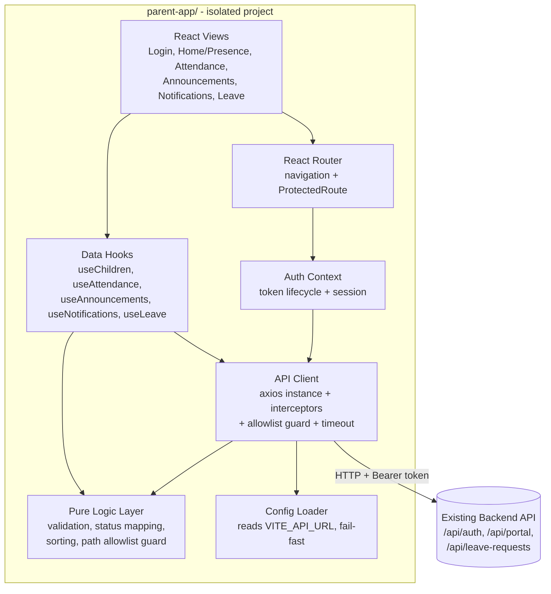

# Design Document

## Overview

This document describes the design for **`parent-app`**, a new, user-friendly parent-facing application for the Avento People Presence Platform. The app is delivered as a **separate, self-contained top-level project** that reuses the existing backend REST API in a read-and-submit capacity. It does not add, remove, or alter any backend endpoint, schema, or behavior, and it shares no source files with `/src` (backend) or `/frontend` (existing admin/portal/superadmin web app).

The application gives parents (the **Stakeholder** role) a simpler, faster, mobile-first experience for five flows:

1. Authenticate against the existing backend.
2. View each child's presence status for the current day.
3. View a child's attendance history over a date range.
4. Read announcements relevant to their children.
5. View notifications.
6. Submit and track leave requests.

### Technology Choices

To mirror the existing stack for consistency while staying fully isolated, `parent-app` uses:

- **React 18 + TypeScript** — same UI framework and language as `/frontend`.
- **Vite 6** — same build tool, instant dev reload, optimized production builds.
- **React Router 6** — client-side navigation between the five views.
- **Axios** — HTTP client, matching the existing frontend's API access pattern.
- **Vitest + fast-check** — unit and property-based testing (fast-check is the de-facto property testing library for the TypeScript ecosystem).

These dependencies live in `parent-app/package.json` — a brand-new manifest that does not reference or modify the root or `/frontend` manifests.

### Backend Contract (External, Unmodifiable Dependency)

The backend is treated as a fixed, external dependency. The relevant endpoints, confirmed by reading `src/routes/auth.ts`, `src/routes/portal.ts`, and `src/routes/leaveRequests.ts`, are:

| Flow | Method & Path | Notes |
|------|---------------|-------|
| Login | `POST /api/auth/login` | Body: `{ email, password, organization_name }` or `{ email, password, organization_id }`. Returns `{ token, user }`. |
| Refresh | `POST /api/auth/refresh` | Body: `{ token }`. Returns `{ token }`. |
| Logout | `POST /api/auth/logout` | Token in body or `Authorization` header. |
| Org lookup | `GET /api/auth/organizations?search=` | Public; returns `{ organizations: [{ id, name }] }` for the login org field. |
| Children + today status | `GET /api/portal/persons` | Returns `{ persons: [{ id, name, ..., current_status: { presence_status, time } \| null }] }`. |
| Attendance history | `GET /api/portal/persons/:id/attendance?start_date&end_date` | Returns `{ attendance: [{ id, date, time, presence_status, created_at }] }`, ordered `date desc`. |
| Notifications | `GET /api/portal/notifications?page&limit` | Returns `{ data: [...], pagination: { page, limit, total, totalPages } }`, ordered `created_at desc`. |
| Announcements | `GET /api/portal/announcements` | Returns `{ announcements: [{ title, body, published_at, ... }] }`, ordered `published_at desc`. |
| Leave requests (list) | `GET /api/leave-requests?page&limit` | Stakeholder sees only their own requests. Returns `{ data: [...], pagination }`. |
| Leave requests (submit) | `POST /api/leave-requests` | Body: `{ person_id, start_date, end_date, reason }`. Returns `{ leave_request }` (status `Pending`). |

> **Design decision / requirements conflict to confirm.** Requirement 9 restricts the app to endpoints under `/api/auth` and `/api/portal` only, but Requirement 7 (submit/track leave requests) cannot be satisfied within that restriction: the backend serves leave requests at **`/api/leave-requests`**, not under `/api/portal`. The existing `/frontend` portal already uses `/api/leave-requests` for the Stakeholder leave flow, and that endpoint already authorizes the `Stakeholder` role. This design therefore treats the allowlist of permitted, pre-existing endpoints as **`/api/auth`, `/api/portal`, and `/api/leave-requests`**, since all three already exist and require no backend change — which honors the deeper intent of Requirement 9 (do not modify the backend). **This deviates from the literal wording of Requirement 9.1 and 9.5 and should be confirmed.** If leave requests must be dropped to keep the strict two-path allowlist, Requirement 7 would need to be removed. I recommend updating Requirement 9 to list the three existing paths.

### Key Design Principles

- **Isolation first.** No file outside `parent-app/` is created, modified, renamed, or deleted. All build output stays inside `parent-app/dist`.
- **Backend integrity.** Only existing endpoints, methods, parameters, and payloads are used. A client-side allowlist guard blocks any request to a disallowed path before it leaves the app.
- **Fail-fast configuration.** The backend base URL is read exclusively from the app's own environment file; a missing value halts startup with a clear error.
- **Mobile-first, calm UX.** Single-column responsive layout, loading indicators, empty states, and retry controls for every data view.

## Architecture

`parent-app` is a single-page application organized in layers so that the testable pure logic (validation, mapping, sorting, guarding) is decoupled from React rendering and from network I/O.



### Layer Responsibilities

- **Config Loader** — Reads `import.meta.env.VITE_API_URL`. If absent or empty at startup, throws a fatal error and renders a configuration-error screen instead of mounting the app (Req 1.6). No hardcoded or `/frontend` fallback URL exists.
- **API Client** — A single axios instance with:
  - `baseURL` from the Config Loader.
  - A **request interceptor** that attaches the `Authorization: Bearer <token>` header when a token is held (Req 2.3) and runs the **path allowlist guard** (Req 9.1, 9.5).
  - A **response interceptor** that, on `401`, clears the token and redirects to login within 1 second (Req 2.5).
  - A per-request **timeout** (30s default for auth and generic requests; 5s for the presence view, 10s for attendance/announcements) that converts timeouts into a uniform failure outcome (Req 2.7, 3.x, 4.7, 5.5, 8.6).
- **Auth Context** — Owns token state, login/logout, session restoration via refresh, and exposes auth status to `ProtectedRoute`.
- **Data Hooks** — One hook per view. Each hook manages `idle | loading | success | empty | error` state, calls the API client, applies pure-logic transformations (sorting/mapping/derivation), and exposes a `retry()` callback.
- **Pure Logic Layer** — Framework-free functions, the primary target for property-based tests: date validation, leave-request validation, presence-status derivation, list sorting, and the path allowlist guard.
- **React Views + Router** — Presentational components and navigation, including a `ProtectedRoute` that redirects unauthenticated users to login.

### Project Structure

```
parent-app/
├── package.json              # own manifest (Req 1.2)
├── vite.config.ts            # own build config; outDir defaults to parent-app/dist (Req 1.7)
├── tsconfig.json
├── .env.example              # documents VITE_API_URL (Req 1.5)
├── index.html
└── src/
    ├── main.tsx              # entry; runs config check before mount (Req 1.6)
    ├── App.tsx               # routes + layout
    ├── config/
    │   └── env.ts            # Config Loader (fail-fast)
    ├── api/
    │   ├── client.ts         # axios instance + interceptors + guard
    │   └── endpoints.ts      # typed wrappers for the allowed endpoints
    ├── lib/                  # pure logic layer (PBT target)
    │   ├── dates.ts          # date format + range validation
    │   ├── presence.ts       # presence-status derivation/normalization
    │   ├── sorting.ts        # attendance/announcement/notification ordering
    │   ├── leave.ts          # leave-request field validation
    │   └── allowlist.ts      # permitted-path guard
    ├── context/
    │   └── AuthContext.tsx
    ├── components/
    │   ├── ProtectedRoute.tsx
    │   ├── AppNav.tsx        # 44x44 touch-target nav (Req 8.7)
    │   ├── LoadingIndicator.tsx
    │   ├── EmptyState.tsx
    │   └── ErrorWithRetry.tsx
    ├── hooks/
    │   ├── useChildren.ts
    │   ├── useAttendance.ts
    │   ├── useAnnouncements.ts
    │   ├── useNotifications.ts
    │   └── useLeaveRequests.ts
    └── pages/
        ├── LoginPage.tsx
        ├── HomePage.tsx          # presence
        ├── AttendancePage.tsx
        ├── AnnouncementsPage.tsx
        ├── NotificationsPage.tsx
        └── LeaveRequestsPage.tsx
```

## Components and Interfaces

### Config Loader (`config/env.ts`)

```typescript
/** Reads the backend base URL exclusively from the app's own env. Fail-fast. */
export function loadApiBaseUrl(): string  // throws ConfigError if missing/empty
export class ConfigError extends Error {}
```

`main.tsx` calls `loadApiBaseUrl()` before rendering the app. On `ConfigError`, it renders a static configuration-error screen and does not mount the router (Req 1.6).

### Path Allowlist Guard (`lib/allowlist.ts`)

```typescript
export const ALLOWED_PREFIXES = ['/api/auth', '/api/portal', '/api/leave-requests'] as const

/** True iff the resolved request path begins with an allowed prefix. */
export function isAllowedPath(path: string): boolean

/** Throws DisallowedRequestError (recording the path) when not allowed. */
export function assertAllowedPath(path: string): void
export class DisallowedRequestError extends Error { readonly path: string }
```

Invoked by the API client request interceptor. The guard normalizes the request URL to its path (relative to `baseURL`) before checking, so query strings and host differences do not bypass it (Req 9.1, 9.5).

### API Client (`api/client.ts`) and Endpoints (`api/endpoints.ts`)

```typescript
// Typed wrappers — the only way the app talks to the backend.
export const authApi = {
  login(input: LoginInput): Promise<LoginResponse>,
  refresh(token: string): Promise<{ token: string }>,
  logout(token: string): Promise<void>,
  listOrganizations(search?: string): Promise<Organization[]>,
}
export const portalApi = {
  getChildren(): Promise<PersonWithStatus[]>,
  getAttendance(personId: string, range: DateRange): Promise<AttendanceRecord[]>,
  getNotifications(page: number): Promise<Paginated<Notification>>,
  getAnnouncements(): Promise<Announcement[]>,
}
export const leaveApi = {
  list(page: number): Promise<Paginated<LeaveRequest>>,
  submit(input: LeaveSubmitInput): Promise<LeaveRequest>,
}
```

Each wrapper sets the appropriate per-call timeout and returns already-normalized domain objects (status derivation and sorting applied via the pure logic layer).

### Auth Context (`context/AuthContext.tsx`)

```typescript
interface AuthContextType {
  token: string | null
  user: ParentUser | null
  isAuthenticated: boolean
  isLoading: boolean
  login(email: string, password: string, organization: string): Promise<void>
  logout(): Promise<void>
}
```

On mount, if a stored token exists, it attempts a silent `refresh` to restore the session (mirroring the existing frontend). `login` stores the token for the active session; `logout` calls the backend then discards the token and returns to login (Req 2.1, 2.4).

### Data Hooks

Each hook returns a discriminated union view-state plus a `retry`:

```typescript
type ViewState<T> =
  | { status: 'loading' }
  | { status: 'success'; data: T }
  | { status: 'empty' }
  | { status: 'error'; message: string }

function useChildren(): { state: ViewState<PersonWithStatus[]>; retry: () => void }
function useAttendance(personId: string, range: DateRange): { state: ...; retry: () => void }
function useAnnouncements(): { state: ViewState<Announcement[]>; retry: () => void }
function useNotifications(): { state: ViewState<Notification[]>; pagination: Pagination; loadMore: () => void; retry: () => void }
function useLeaveRequests(): { state: ViewState<LeaveRequest[]>; submit: (input) => Promise<void>; retry: () => void }
```

Hooks own the loading/empty/error/retry behavior required across Requirements 3–8, and retain previously loaded data on retryable failures where required (Req 6.6, 8.5).

### React Views

- **LoginPage** — email, password, organization fields; client-side required-field validation (Req 2.6); preserves email + organization and clears password on rejection (Req 2.2).
- **HomePage (Presence)** — lists each child with name and one of `Present | Absent | Late | On_Leave | Not yet marked` (Req 3.2, 3.3); empty/loading/error+retry states.
- **AttendancePage** — child selector + start/end date inputs; client-side date format and range validation (Req 4.4, 4.6); records ordered by date descending (Req 4.3).
- **AnnouncementsPage** — title/body/published date, most-recent first (Req 5.2).
- **NotificationsPage** — title/body/sent date (created date fallback), page size 20, load-more (Req 6.1–6.3).
- **LeaveRequestsPage** — submission form + list with status; client-side validation (Req 7.2, 7.3); confirmation + form clear on success (Req 7.4).
- **AppNav** — navigation between the five views with ≥44×44px touch targets (Req 8.7).

## Data Models

These TypeScript types model the existing backend responses; they introduce no new backend fields (Req 9.2, 9.3). Fields the app does not need are simply omitted.

```typescript
type PresenceStatus = 'Present' | 'Absent' | 'Late' | 'On_Leave'
type DisplayPresenceStatus = PresenceStatus | 'Not yet marked'

interface ParentUser {
  id: string
  email: string
  role: 'Stakeholder'
  organization_id: string
}

interface Organization { id: string; name: string }

interface PersonWithStatus {
  id: string
  name: string
  current_status: { presence_status: PresenceStatus; time: string } | null
}

interface AttendanceRecord {
  id: string
  date: string          // YYYY-MM-DD
  time: string | null
  presence_status: PresenceStatus
}

interface Announcement {
  id: string
  title: string
  body: string
  published_at: string  // ISO timestamp
}

interface Notification {
  id: string
  title: string
  body: string
  sent_at: string | null
  created_at: string    // ISO timestamp
}

type LeaveStatus = 'Pending' | 'Approved' | 'Rejected'

interface LeaveRequest {
  id: string
  person_id: string
  person_name?: string
  start_date: string    // YYYY-MM-DD
  end_date: string      // YYYY-MM-DD
  reason: string
  status: LeaveStatus
}

interface DateRange { start_date: string; end_date: string }

interface LeaveSubmitInput {
  person_id: string
  start_date: string
  end_date: string
  reason: string
}
```

### Derived/UI State Models

```typescript
interface Pagination { page: number; limit: 20; total: number; totalPages: number }
type ConfigState = { ok: true; baseUrl: string } | { ok: false; error: string }
```

### Pure Logic Function Signatures (PBT target)

```typescript
// lib/dates.ts
function isValidDateFormat(value: string): boolean              // strict YYYY-MM-DD
function isValidRange(range: DateRange): boolean                 // end >= start, both valid format

// lib/presence.ts
function toDisplayStatus(s: PersonWithStatus): DisplayPresenceStatus  // null -> 'Not yet marked'

// lib/sorting.ts
function sortAttendanceByDateDesc(rs: AttendanceRecord[]): AttendanceRecord[]
function sortAnnouncementsByPublishedDesc(as: Announcement[]): Announcement[]
function sortNotificationsByEffectiveDateDesc(ns: Notification[]): Notification[] // sent_at ?? created_at

// lib/leave.ts
interface LeaveValidationResult { ok: boolean; errors: Partial<Record<keyof LeaveSubmitInput, string>> }
function validateLeaveSubmit(input: LeaveSubmitInput): LeaveValidationResult     // required + non-whitespace reason + range

// lib/allowlist.ts
function isAllowedPath(path: string): boolean
```

## Correctness Properties

*A property is a characteristic or behavior that should hold true across all valid executions of a system — essentially, a formal statement about what the system should do. Properties serve as the bridge between human-readable specifications and machine-verifiable correctness guarantees.*

The properties below target the framework-free **pure logic layer** (`lib/*`) and the API client's request behavior, which is where input variation meaningfully exercises edge cases. UI states (loading/empty/error/retry), interaction flows, responsive layout, and the file-system isolation guarantees are validated by example, snapshot, and integration tests instead (see Testing Strategy), since they do not vary meaningfully across generated inputs.

### Property 1: Token is attached to every outgoing request

*For any* held auth token and *any* request to an allowed endpoint, the outgoing request SHALL carry the header `Authorization: Bearer <token>` exactly matching the held token.

**Validates: Requirements 2.3**

### Property 2: Login validation flags exactly the missing fields

*For any* combination of email, password, and organization values where at least one is empty or whitespace-only, login validation SHALL fail, SHALL suppress the authentication request, and SHALL report exactly the set of fields that are missing — no more and no fewer.

**Validates: Requirements 2.6**

### Property 3: Presence status derivation is total and correct

*For any* `PersonWithStatus`, the derived display status SHALL be exactly one of `Present`, `Absent`, `Late`, `On_Leave`, or `Not yet marked`; and it SHALL equal `Not yet marked` if and only if the person's `current_status` is null.

**Validates: Requirements 3.2, 3.3**

### Property 4: Attendance history is ordered by date descending

*For any* list of attendance records, the displayed list SHALL be a permutation of the input (no records added or dropped) whose dates are in non-increasing order.

**Validates: Requirements 4.3**

### Property 5: Strict date-format validation

*For any* string, date-format validation SHALL return true if and only if the string is a strictly well-formed `YYYY-MM-DD` calendar date; when validation returns false for a start or end date, no backend request SHALL be sent.

**Validates: Requirements 4.4**

### Property 6: Date-range ordering validation

*For any* pair of well-formed dates used as a range, range validation SHALL succeed if and only if the end date is greater than or equal to the start date; when it fails, no backend request SHALL be sent. This rule governs both the attendance date filter and the leave-request date range.

**Validates: Requirements 4.6, 7.2**

### Property 7: Announcements are ordered by published date descending

*For any* list of announcements, the displayed list SHALL be a permutation of the input whose published dates are in non-increasing order.

**Validates: Requirements 5.2**

### Property 8: Notifications are ordered by effective date descending

*For any* list of notifications, the effective date of each notification SHALL equal its `sent_at` when present and its `created_at` otherwise, and the displayed list SHALL be a permutation of the input whose effective dates are in non-increasing order.

**Validates: Requirements 6.1, 6.2**

### Property 9: Leave-request submission validation

*For any* leave-submission input, validation SHALL fail (and suppress the backend request) whenever any required field (person, start date, end date, reason) is empty or the reason is whitespace-only, reporting exactly the offending fields; and it SHALL succeed only when all required fields are present, the reason contains non-whitespace content, and the date range is valid per Property 6.

**Validates: Requirements 7.3**

### Property 10: Path allowlist guard

*For any* request path, the guard SHALL permit it if and only if it begins with one of the allowed prefixes (`/api/auth`, `/api/portal`, `/api/leave-requests`); for any other path, the guard SHALL block the request before it is sent and SHALL record an error identifying the disallowed path.

**Validates: Requirements 9.1, 9.5**

## Error Handling

The app handles failures uniformly so every data view satisfies the loading/empty/error/retry contract in Requirements 3–8.

### Configuration Errors (Req 1.6)

- `loadApiBaseUrl()` throws `ConfigError` when `VITE_API_URL` is missing, empty, or whitespace-only.
- `main.tsx` catches `ConfigError` before mounting the router and renders a static "Backend API base URL is not configured" screen. No hardcoded or `/frontend` fallback is ever used.

### Network and Server Errors (Req 8.4, 8.5, 8.6, 9.4)

- Each API call runs through the axios instance with a per-call timeout (5s presence, 10s attendance/announcements, 30s auth and default). Exceeded timeouts reject with a normalized `TimeoutError`.
- The data hooks translate any rejection into `{ status: 'error', message }` with a view-appropriate message and expose `retry()` that re-issues the **same** allowed request.
- Views that must retain prior data on failure (notifications Req 6.6; general Req 8.5) keep the last successful `data` and overlay a non-destructive error + retry affordance.
- Non-success responses are handled entirely within the app; the retry never targets a different or altered endpoint (Req 9.4) because all calls pass through the allowlist guard.

### Authentication Errors (Req 2.2, 2.5, 2.7)

- `401` responses trigger the response interceptor: clear token, redirect to login within 1 second.
- Login rejection (`401`/`Organization not found`) keeps the user on the login screen, retains email and organization, clears the password, and shows a credentials error.
- Auth request timeout (30s) cancels the request and shows a service-unreachable message.

### Disallowed Requests (Req 9.5)

- The allowlist guard throws `DisallowedRequestError` synchronously in the request interceptor, before the request is dispatched, and records the offending path (console error + in-app error indication). This is a developer-facing safety net; in normal operation only `endpoints.ts` wrappers issue requests, all of which target allowed paths.

### Validation Errors (Req 2.6, 4.4, 4.6, 7.2, 7.3)

- All field and date validation runs client-side in the pure logic layer before any request is issued. Invalid input produces an inline message identifying the problem and suppresses the request.

## Testing Strategy

The app uses a dual approach: **property-based tests** for the pure logic layer (where input variation matters) and **example / snapshot / integration tests** for UI behavior, flows, and the isolation guarantees.

### Tooling

- **Vitest** as the test runner (native Vite integration, no extra build config).
- **fast-check** for property-based testing — chosen because it is the established PBT library for TypeScript; PBT is not implemented from scratch.
- **@testing-library/react** for component and interaction tests.
- All test files live under `parent-app/` only, preserving isolation (Req 1.x).

### Property-Based Tests

- One property-based test per correctness property (Properties 1–10).
- Each test runs a **minimum of 100 iterations**.
- Each test is tagged with a comment referencing its design property, using the format:
  `// Feature: user-friendly-app, Property {number}: {property_text}`
- Custom fast-check arbitraries generate: tokens and endpoint paths (Property 1, 10), field combinations with blank/whitespace variants (Properties 2, 9), `PersonWithStatus` with null and non-null status (Property 3), arbitrary date strings including malformed and boundary dates (Properties 5, 6), and lists of attendance/announcement/notification records with arbitrary and duplicate dates plus null `sent_at` (Properties 4, 7, 8).

### Example-Based Unit Tests

Cover specific flows and states that do not vary meaningfully with input:

- Config loader reads `VITE_API_URL` (Req 1.5).
- Login success/logout flows and token storage (Req 2.1, 2.4).
- `401` redirect and auth timeout handling (Req 2.5, 2.7).
- Per-view loading, empty, and error+retry states (Req 3.4–3.6, 4.5, 4.7, 5.3–5.5, 6.3–6.6, 7.4–7.8, 8.3–8.6).
- Attendance request parameter passing (Req 4.1, 4.2) and leave submission payload formatting (Req 7.1).
- Retry re-issues the same request and retains data (Req 8.5, 9.4).

### Edge-Case Tests

- Empty / whitespace / undefined `VITE_API_URL` produces `ConfigError` with no fallback (Req 1.6).

### Snapshot / Layout Tests

- Single-column mobile (320–767px) and desktop (≥768px) layouts render without horizontal overflow (Req 8.1, 8.2).
- Navigation controls render with ≥44×44px touch targets (Req 8.7).

### Integration / Isolation Tests

- A repository-level check hashes every file under `/src` and `/frontend` before and after running `parent-app` build/test/dev, asserting byte-for-byte equality (Req 1.3, 1.4) and that build output is confined to `parent-app/dist` (Req 1.7).
- A structural check confirms `parent-app/` is a sibling sharing no files and has its own manifest/build config (Req 1.1, 1.2, 7-path review for Req 9.2, 9.3).
- Smoke tests run a few representative end-to-end calls against a mocked backend to confirm `endpoints.ts` targets only existing routes.

### Why PBT Does Not Cover Everything

Responsive layout and touch-target sizing (Req 8.1, 8.2, 8.7) are visual/structural concerns; the file-isolation guarantees (Req 1.1–1.4, 1.7) are process-level invariants verified by hashing rather than input-varying logic; and the per-view loading/empty/error flows are deterministic given a mocked response. These are best served by snapshot, integration, and example tests, so they are intentionally excluded from the property set.
